# AgentOS

> A **modular .NET agentic platform** for software-delivery workflows. A central orchestrator
> coordinates specialist agents — Requirements → Code → Tests → QA — over a provider-agnostic
> LLM gateway, on a multi-tenant runtime with row-level isolation and a Blazor AgentOS desktop UI.

[](https://github.com/hoangsnowy/AgentOs/actions/workflows/ci.yml)
[](LICENSE)


[](CONTRIBUTING.md)

<p align="center">
  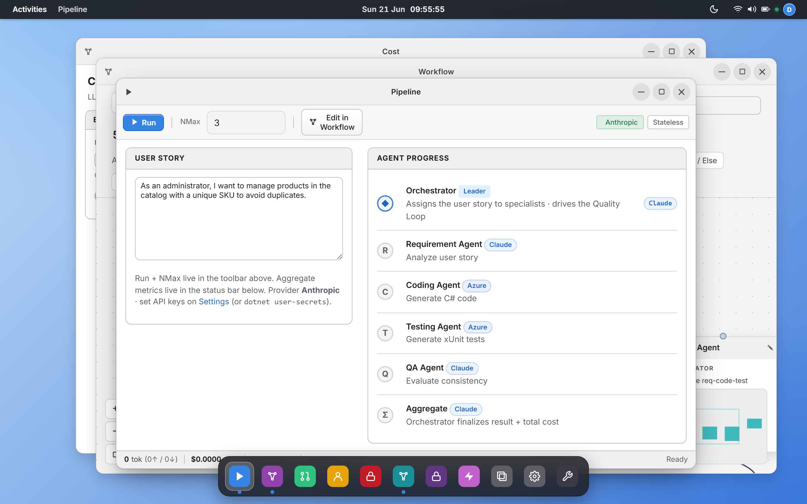
  <br>
  <sub><em>The <strong>AgentOS</strong> desktop — a Blazor Server window manager rendering an authentic GNOME shell (empty wallpaper, Activities overview, virtual workspaces, Dash) that launches the agent pipeline, the visual workflow editor, Board, and per-tenant governance as windows.</em></sub>
</p>

AgentOS turns a plain-English user story into reviewed, test-backed C# scaffolding. Five agents
collaborate under a central orchestrator; a QA agent scores requirement–code–test consistency and
loops until convergence or an iteration cap. The platform itself is a modular monolith — each
feature (LLM gateway, pipeline runtime, identity, tenants, settings store, integrations, remote
agent transport) is a self-contained `IModule` with its own DI surface, EF Core context, and
Postgres schema, so any one of them can later ship as a standalone NuGet package.

> **Status:** pre-1.0. The core pipeline, gateway, modular runtime, and multi-tenant identity are
> working; public surfaces may shift before `v1.0`.

**Contents:** [Why AgentOS](#why-agentos) · [Screenshots](#screenshots) · [Concepts](#concepts) · [Architecture](#architecture) ·
[Quick start](#quick-start) · [Modules](#modules) · [LLM gateway](#llm-gateway) ·
[Configuration](#configuration) · [Multi-tenant](#multi-tenant) · [API](#api) ·
[Extending](#extending) · [Deploy](#deploy) · [Contributing](#contributing)

### Which doc do I read for X?

| I want to… | Read |
|---|---|
| Understand AgentOS / architecture | [README.md](README.md) |
| Set up & run locally | [docs/SETUP.md](docs/SETUP.md) |
| Deploy to Azure | [docs/DEPLOYMENT.md](docs/DEPLOYMENT.md) + [infra/README.md](infra/README.md) |
| Contribute / conventions | [CONTRIBUTING.md](CONTRIBUTING.md) |
| UI / design system | [docs/design/design-system.md](docs/design/design-system.md) |
| Agent prompts | [docs/prompts/v1/*.md](docs/prompts/v1/) |
| Where the product is headed | [ROADMAP.md](ROADMAP.md) |
| Report a vulnerability | [SECURITY.md](SECURITY.md) |

## Why AgentOS

- **Modular by construction.** Every feature is an `IModule` discovered by reflection. Hosts wire
  the whole platform with a single `services.AddModulesFromAssemblies(cfg, …)` call; no module
  references another's runtime types — only contracts in `Domain` / `SharedKernel`.
- **Provider-agnostic LLM gateway.** Claude (Anthropic.SDK), Azure OpenAI (`Azure.AI.OpenAI`),
  MAF (Microsoft Agent Framework), and a remote dev-IDE agent all register as keyed
  `ILlmClient` under their canonical name. Swap a provider in `appsettings.json`; no code change.
- **Multi-tenant from day one.** Row-level isolation via EF Core global query filters; a
  Keycloak-backed OIDC `tenant` claim drives `ITenantContext`. A Development-only `DevAutoLogin`
  handler keeps a fixed user for standalone local runs; anonymous requests fall back to a default
  tenant.
- **Per-module DbContext + schema.** `pipeline.*`, `tenants.*`, `config.*` live in their own
  schemas with their own migration histories. Each module owns its persistence end-to-end.
- **Resilient gateway.** Multi-key round-robin with HTTP 429 cooldown / `Retry-After`, exponential
  backoff on transient failures.
- **Cloud-ready out of the box.** A .NET Aspire AppHost wires Postgres + Keycloak + Api + Web; an
  `azd up` deploys to Azure Container Apps.
- **Operator-friendly desktop.** A Blazor Server AgentOS desktop — authentic GNOME: an empty
  wallpaper, a Dash, a GNOME Activities overview, virtual workspaces, light/dark themes, a live
  pipeline runner, a drag-and-drop workflow editor, and runtime settings to rotate LLM keys without
  a redeploy.

## Screenshots

A GNOME/Adwaita desktop in the browser — every capability ships as a window, not a wall of
config. All shots are the standalone Web (`dotnet run --project src/AgentOs.Web`).

| Overview — the control plane | Terminal — runner session feed |
|:---:|:---:|
| [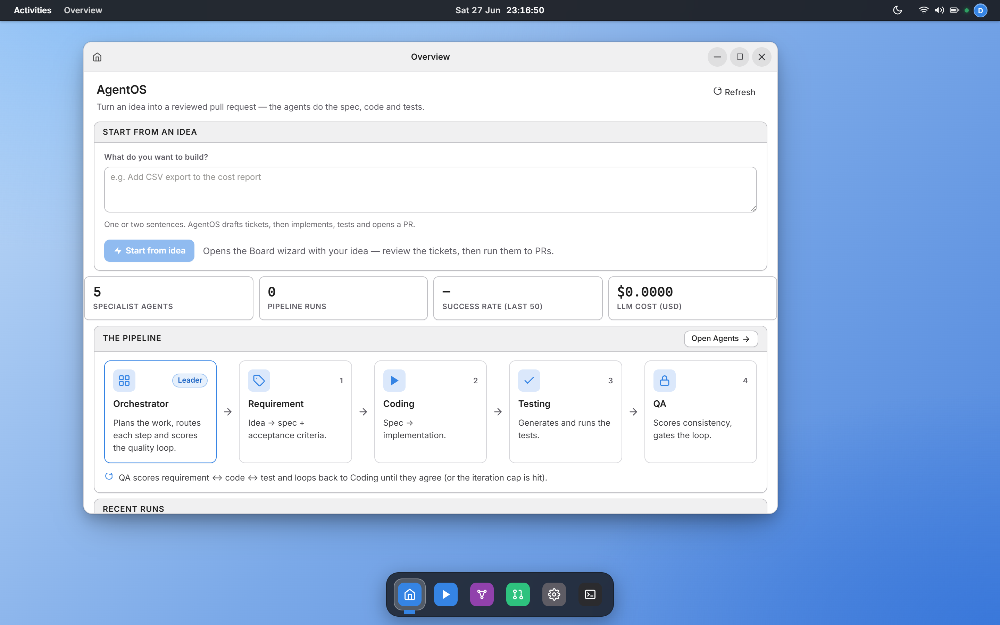](docs/images/app-overview.png) | [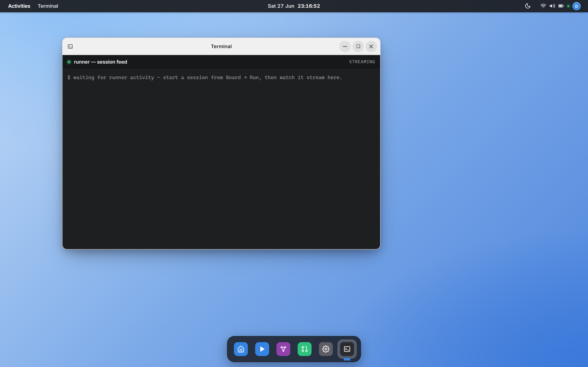](docs/images/app-terminal.png) |
| Start from an idea; headline KPIs (runs, success rate, cost), the 5-agent pipeline at a glance, and recent runs. | A read-only live tail of the paired runner's session feed (`ISessionRunFeed`) — what the remote agent is doing, streamed. |

| Realtime pipeline | Visual workflow editor |
|:---:|:---:|
| [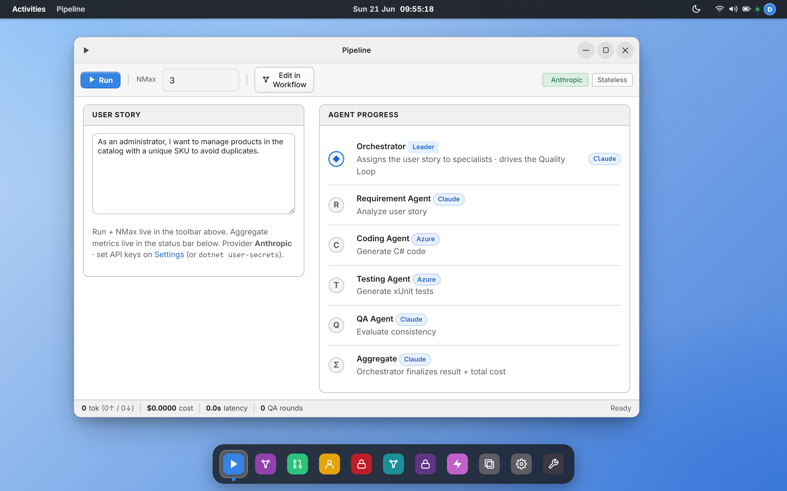](docs/images/app-pipeline.png) | [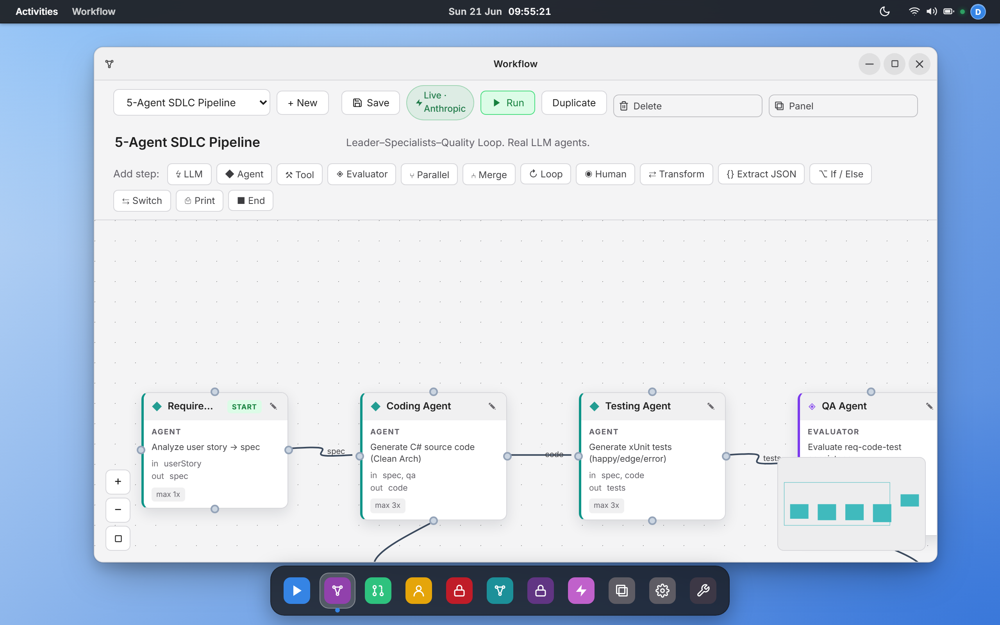](docs/images/app-workflow.png) |
| The five agents (Orchestrator → Requirement → Coding → Testing → QA) with live token/cost/QA-round metrics. | The same pipeline as an editable MAF Workflow graph — drag LLM / Tool / Evaluator / Loop / Human nodes. |

| Boards → Tickets → Sessions | Tool-call evidence |
|:---:|:---:|
| [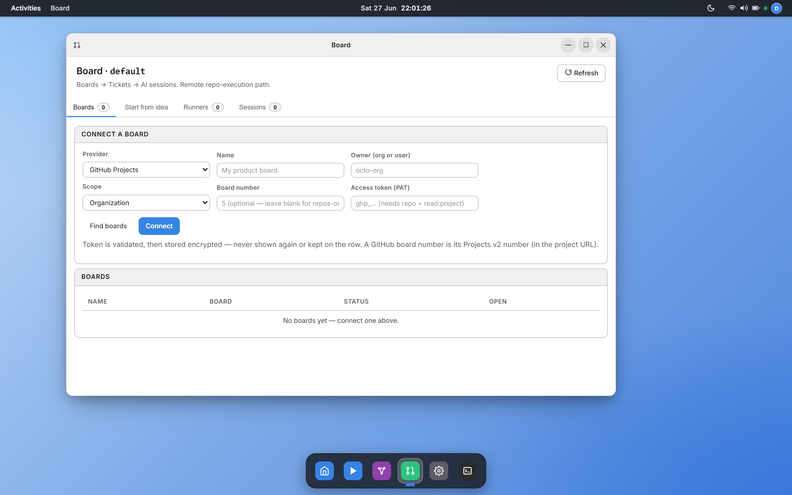](docs/images/app-board.png) | [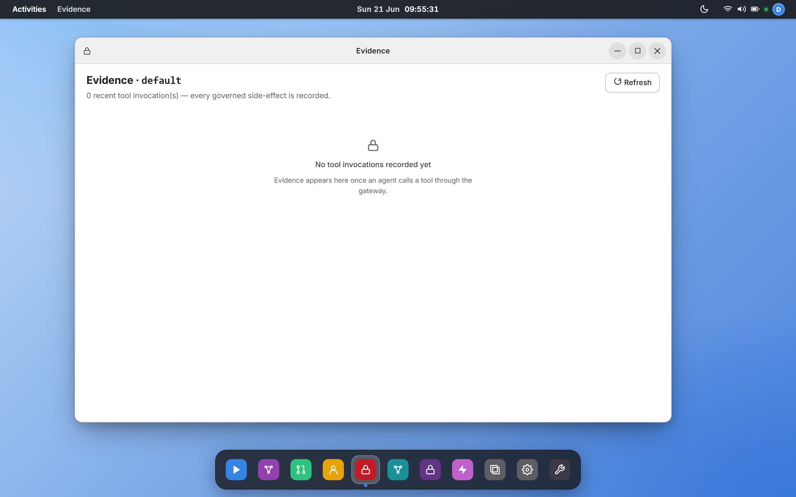](docs/images/app-evidence.png) |
| Connect a GitHub/ADO board, decompose an idea into tickets, drive remote repo-execution sessions. | Every tool an agent calls passes the policy gate and is recorded as auditable evidence. |

| Cost & budget gate | Runtime settings |
|:---:|:---:|
| [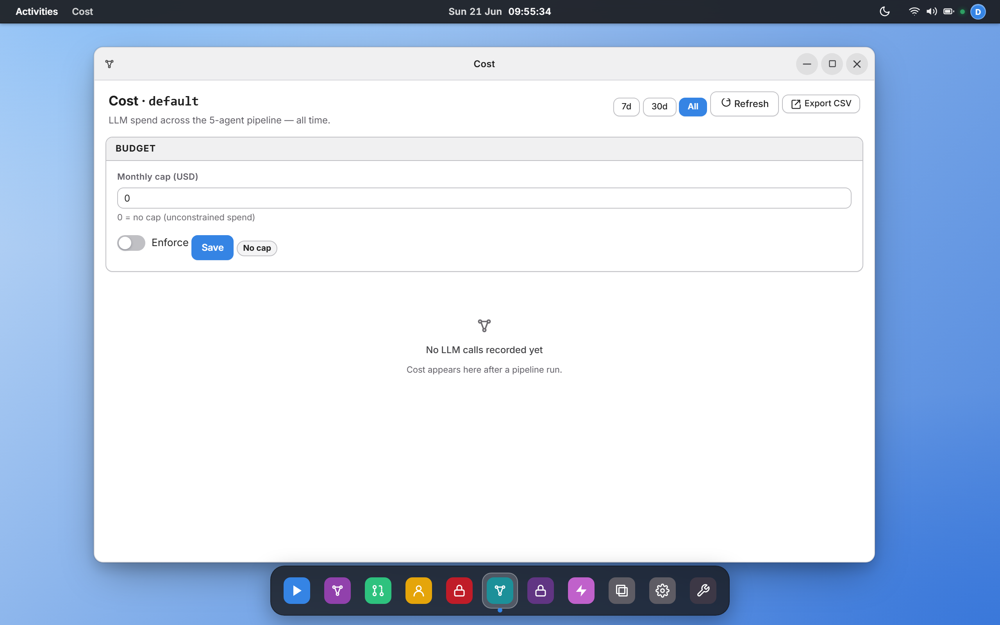](docs/images/app-cost.png) | [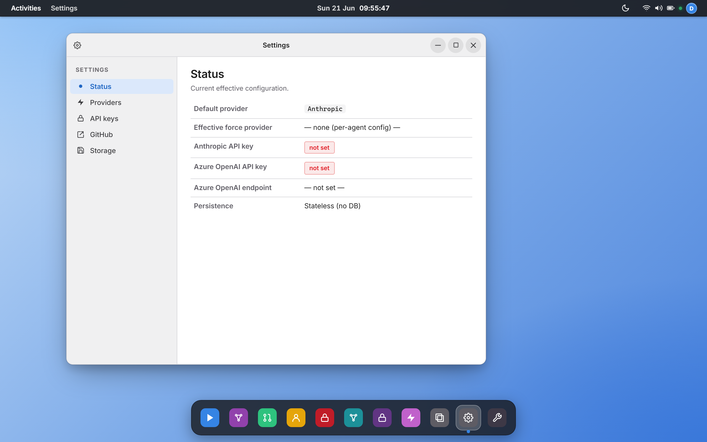](docs/images/app-settings.png) |
| Per-tenant LLM spend, a monthly cap with an enforce toggle, CSV export. | Rotate provider keys and switch providers at runtime — no redeploy. |

Light and dark are first-class (system menu → toggle):

| Light | Dark |
|:---:|:---:|
| [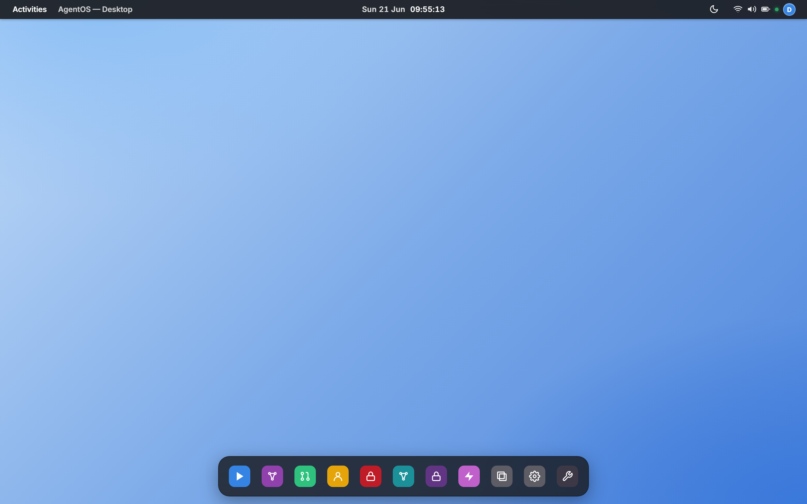](docs/images/desktop-light.png) | [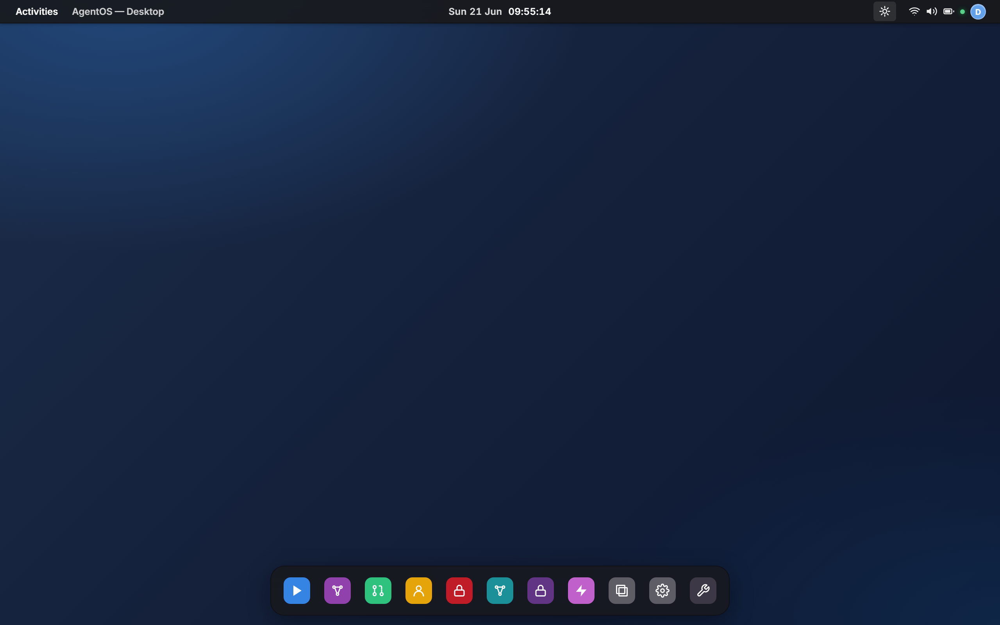](docs/images/desktop-dark.png) |

More windows — multi-tenant **Users**, **Policy**, **Prompts**, **Plugins**, **System** — live in
[`docs/images/`](docs/images/).

## Concepts

| Concept | Lives in | Notes |
|---|---|---|
| **Module** | `IModule` (SharedKernel) | One assembly = one module. Optional `IEndpointModule` (HTTP) + `IInitializableModule` (startup hook). Discovered + invoked by `ModuleLoader`. |
| **Agent** | `Modules.Pipeline.Agents` | A specialist: `IRequirementAgent`, `ICodingAgent`, `ITestingAgent`, `IQaAgent`, `IOrchestratorAgent`. Consumes `ILlmClient` via `ILlmClientFactory`. |
| **LLM client** | `Domain.Llm.ILlmClient` | One method: `SendAsync(LlmRequest, ct) → LlmResponse`. Each provider impl registers as a keyed singleton. |
| **Tenant context** | `SharedKernel.Identity.ITenantContext` | Per-request scope: tenant id, user id, roles. DbContexts filter by `TenantId`; repos stamp on write. |
| **App config store** | `Modules.AppConfig.IAppConfigStore` | Encrypted runtime key-value store (DataProtection). Powers per-tenant LLM key overrides and the Settings UI. |

## Architecture

```
src/
├── AgentOs.Domain/             # DTOs, ILlmClient, ILlmClientFactory, exceptions (BCL-only)
├── AgentOs.SharedKernel/       # IModule contracts + ModuleLoader + ITenantContext + IAuthTokenProvider
├── AgentOs.Modules.AppConfig/  # Encrypted KV store, AppConfigDbContext (schema: config)
├── AgentOs.Modules.Llm/        # Gateway, providers, key pool, runtime overrides
├── AgentOs.Modules.Pipeline/   # Agents + prompts + orchestrator + PipelineDbContext (schema: pipeline)
├── AgentOs.Modules.Identity/   # Keycloak JwtAuth + HttpTenantContext + Admin/Member policies
├── AgentOs.Modules.Tenants/    # Keycloak admin + TenantsDbContext (schema: tenants) + /tenants
├── AgentOs.Modules.Integration/# GitHub PR + dotnet build verifier (+ BuildVerifierTool)
├── AgentOs.Modules.Workspaces/ # Connected source workspaces + WorkspacesDbContext (schema: workspaces)
├── AgentOs.Modules.Sessions/   # Remote-runner registry + pairing + SessionsDbContext (schema: sessions)
├── AgentOs.Modules.Tools/      # ITool contract + IToolRegistry + IToolPolicy + IToolInvocationLog
├── AgentOs.Modules.Mcp/        # MCP client — connects to external MCP servers, registers their tools
├── AgentOs.Modules.RemoteAgent/# SignalR hub + transport + RemoteAgentLlmClient
├── AgentOs.Api/                # ASP.NET Core minimal API (+ Scalar UI). Composition root only.
├── AgentOs.Web/                # Blazor Server AgentOS desktop. Composition root only.
├── AgentOs.RemoteAgent/        # Standalone IDE-side agent (dev machine)
└── AgentOs.ServiceDefaults/    # OpenTelemetry, health checks, HTTP resilience
infra/
└── AgentOs.AppHost/            # .NET Aspire orchestration
tests/                          # xUnit (~800 unit/integration) + Playwright E2E
```

Module dependency rule: a module references **Domain + SharedKernel only**. Cross-module
references are explicit and minimal (Llm → AppConfig for hydrated overrides; Tenants → Identity
for the JWT scheme; RemoteAgent → Llm for the keyed registration shape; Integration → AppConfig
and → Tools so BuildVerifierTool registers via `AddTool<>()`). Hosts ref every module.

### Tools & MCP

Agents call **tools** (build_verifier, MCP-exposed GitHub / filesystem actions, custom ITools)
through the LLM gateway: `LlmRequest.Tools = ["build_verifier"]` causes `PooledChatLlmClient` to
resolve each name via `IToolRegistry`, adapt the `ITool` into a `Microsoft.Extensions.AI.AIFunction`,
and wrap the chat client with `FunctionInvokingChatClient` so the tool-call loop runs transparently
inside `SendAsync`. Every invocation passes through `IToolPolicy` (gate) and `IToolInvocationLog`
(evidence) so refused and successful calls alike are auditable.

`AgentOs.Modules.Mcp` connects to upstream **MCP servers** at startup and registers their tools
under the prefix `{server}.{tool}` — local and remote tools live in the same registry. The Api
host also serves **MCP itself** at `/mcp` (Streamable HTTP), exposing `run_pipeline`, `list_runs`,
and `get_run` so any MCP host (Claude Desktop, VS Code, custom orchestrator) can drive AgentOS.
End result: a tool mesh where AgentOS is both an MCP consumer and an MCP provider.

**Pipeline dataflow:**

```
UserStory ─► RequirementAgent ─► RequirementSpec ─► CodingAgent ─► CodeArtifact
                                                                       │
                                                                       ▼
                                       PipelineResult ◄── QaAgent ◄── TestingAgent
                                              │
                                              └── PipelineRunRepository (pipeline.pipeline_runs + run_metrics)
```

QA scores the triple and decides "ship it" or "iterate" (capped by `NMax`).

## Quick start

Prerequisites: **.NET 10 SDK** (pinned via `global.json`). For the multi-tenant smoke also
Docker (used by Aspire to run Postgres + Keycloak). An Anthropic and/or Azure OpenAI key is
required for live runs.

```bash
git clone https://github.com/hoangsnowy/AgentOs.git
cd AgentOs

dotnet restore AgentOs.slnx
dotnet build   AgentOs.slnx -c Release
dotnet test    AgentOs.slnx -c Release
```

Run the API on its own (Scalar UI at `https://localhost:5080/scalar/v1`):

```bash
dotnet run --project src/AgentOs.Api
```

Or run the whole stack — Aspire wires Postgres + Keycloak + Api + Web and forwards env vars:

```bash
dotnet run --project infra/AgentOs.AppHost
```

Drive the end-to-end pipeline from the **AgentOS desktop**: on the Aspire stack the Web is at
`https://localhost:5180`; sign in with the seeded `operator` / `operator` credentials (a
cookie session via `/account/login`), open the Agents app, and run a user story. The API
endpoints below are bearer-protected — the Web obtains the token for you; for a scripted call
against the API, attach a Keycloak-issued bearer token from the realm.

> The pair `RemoteAgent` provider can dispatch LLM calls to a dev-machine agent at zero API cost
> when a remote agent is paired (see [Modules](#modules)).

## Modules

| Module | Schema | Endpoints | Notes |
|---|---|---|---|
| **AppConfig** | `config` | `/settings*` | Encrypted KV (`Microsoft.AspNetCore.DataProtection`). Per-tenant. |
| **Llm** | — | `/llm/test` (Api shell) | Gateway, keyed `ILlmClient` per provider, multi-key pool with 429 failover. |
| **Pipeline** | `pipeline` | `/pipeline`, `/pipeline/stream`, `/requirement`, `/code`, `/test`, `/qa`, `/runs*` | Agents + orchestrator + run history (jsonb artifact). |
| **Identity** | — | — | `ITenantContext` (claims-based) + `Admin`/`Member` policies. The auth scheme is host-specific (Api = Keycloak JWT bearer; Web = cookie + OIDC). |
| **Tenants** | `tenants` | `/tenants/me`, `/tenants`, `/tenants/{id}/members` | Tenant registry + Keycloak admin REST client for provisioning. |
| **Integration** | — | — | `IGitHubPrService` + `IBuildVerifier`. Used by the Pipeline orchestrator. |
| **Workspaces** | `workspaces` | `/workspaces*` | Connected source workspaces (repo/token registry) + `IWorkspaceConnector`. |
| **Sessions** | `sessions` | `/sessions*`, `/runners*` | Remote-runner registry + pairing handshake + live session-run feed. |
| **RemoteAgent** | — | `/hubs/remote-agent` (SignalR) | Dispatches LLM calls to a paired dev-machine agent (zero API tokens). |

## LLM gateway

Agents depend only on `ILlmClient`; `LlmClientFactory.Create(providerName)` resolves a keyed
implementation registered under its canonical name. Supported provider keys:

| Key | Backend | Owning module |
|---|---|---|
| `Claude` | Anthropic.SDK (pooled over multi-key) | `Modules.Llm` |
| `AzureOpenAI` | `Azure.AI.OpenAI` (pooled over multi-key) | `Modules.Llm` |
| `MAF` | Microsoft Agent Framework over Azure OpenAI | `Modules.Llm` |
| `RemoteAgent` | SignalR-dispatched dev-machine agent | `Modules.RemoteAgent` |

`Llm:ForceProvider` (config) and the runtime overrides set from the Settings UI override the
per-agent provider. A runtime `IRuntimeOverrides` is hydrated at startup from `AppConfig` so a
process restart keeps the operator's last-saved keys.

### Default agent mapping

| Agent | Default provider | Default model |
|---|---|---|
| Orchestrator | Claude | `claude-haiku-4-5` |
| Requirement | Claude | `claude-sonnet-4-6` |
| Coding | AzureOpenAI | `gpt-4.1` |
| Testing | AzureOpenAI | `gpt-4o-mini` |
| QA | Claude | `claude-haiku-4-5` |

Illustrative only — reassign any agent to any provider in `appsettings.json`. The shipped config
uses the provider alias `Anthropic`, which `LlmClientFactory.NormalizeKey` normalizes to `Claude`.

## Configuration

Set keys via user-secrets — never commit them:

```bash
cd src/AgentOs.Api
dotnet user-secrets set "Llm:Claude:ApiKey"      "sk-ant-..."
dotnet user-secrets set "Llm:AzureOpenAi:ApiKey" "..."
dotnet user-secrets set "Llm:AzureOpenAi:Endpoint" "https://<resource>.openai.azure.com"
```

Per-agent provider/model lives in `appsettings.json`:

```json
{
  "Llm": {
    "Claude":      { "ApiKey": "", "ApiKeys": [] },
    "AzureOpenAi": { "Endpoint": "", "ApiKey": "", "ApiKeys": [], "Model": "gpt-4.1" }
  },
  "Agents": {
    "Orchestrator": { "Provider": "Claude",      "Model": "claude-haiku-4-5", "Temperature": 0.3, "MaxTokens": 2000 },
    "Requirement":  { "Provider": "Claude",      "Model": "claude-sonnet-4-6", "Temperature": 0.1, "MaxTokens": 2000 },
    "Coding":       { "Provider": "AzureOpenAI", "Model": "gpt-4.1",          "Temperature": 0.2, "MaxTokens": 4000 },
    "Testing":      { "Provider": "AzureOpenAI", "Model": "gpt-4o-mini",      "Temperature": 0.2, "MaxTokens": 3000 },
    "Qa":           { "Provider": "Claude",      "Model": "claude-haiku-4-5", "Temperature": 0.1, "MaxTokens": 1500 }
  }
}
```

### Multi-key pool + 429 failover

Give a provider a pool; the gateway round-robins across keys, cools any key that returns HTTP 429
(honoring `Retry-After`), and routes to the next. One throttled key never stalls the pipeline.

```json
{
  "Llm": {
    "Claude":      { "ApiKeys": ["sk-ant-a", "sk-ant-b", "sk-ant-c"] },
    "AzureOpenAi": { "ApiKeys": ["key-east",  "key-west"] }
  }
}
```

The effective pool combines `ApiKeys` + the single `ApiKey` + any Settings runtime override
(deduped). Azure keys in a pool share the configured endpoint.

### Persistence

`ConnectionStrings:DefaultConnection` (Postgres) is the only required wiring; each module
attaches its own DbContext with its own schema + migration history. The Aspire AppHost provisions
this automatically. To run the Api standalone against an existing Postgres:

```bash
dotnet user-secrets set "ConnectionStrings:DefaultConnection" \
  "Host=localhost;Port=5432;Database=agentos;Username=postgres;Password=postgres"
```

To boot stateless (no DB) — useful for unit tests or quick smoke runs:

```bash
$env:Persistence__RequireDatabase = "false"   # PowerShell
export Persistence__RequireDatabase=false      # bash
```

…which swaps in the in-memory `Null*Repository` implementations.

## Multi-tenant

| Host | Authentication | Tenant context |
|---|---|---|
| **Api** | Keycloak RS256 bearer — a resource server that validates the token against the realm JWKS | `HttpTenantContext` reads the `tenant` claim + realm roles |
| **Web** | Cookie + OpenID Connect against Keycloak (seeded `operator` / `member` realm users), or `Auth:DevAutoLogin` — a Development-only fixed-user handler — for standalone runs | the same `HttpTenantContext`; anonymous requests fall back to the default tenant |

There is no `Auth:Mode` switch and no operator-password form — a single claims-based
`HttpTenantContext` is wired for both hosts. `POST /tenants` provisions a new tenant + admin user in
Keycloak via `IKeycloakAdminClient`. The Aspire AppHost runs Keycloak with an auto-imported
`agentic` realm (`infra/keycloak/`), so a full multi-tenant smoke is one
`dotnet run --project infra/AgentOs.AppHost` away.

Row-level isolation: `PipelineRun`, `RunMetric`, `Orchestration`, and `AppConfig` rows carry a
`TenantId` column and a global EF query filter that reads `ITenantContext.TenantId`. Writes stamp
the tenant id; reads only see your own.

## API

All `/pipeline*`, `/requirement`, `/code`, `/test`, `/qa`, `/runs*`, `/settings*`, and `/tenants*`
endpoints require an authenticated principal. The API host validates a Keycloak-issued bearer
token in the `Authorization` header; the Web host authenticates the user via a cookie session
(`GET /account/login` → an OIDC challenge against Keycloak). `/health`, `/alive`, and `/` are public.

| Method | Path | Auth | Description |
|---|---|---|---|
| `GET`  | `/account/login` | none | Start an operator/OIDC sign-in (Web host) |
| `GET`  | `/account/logout` | any | Sign out (Web host) |
| `GET`  | `/tenants/me` | any | Resolved tenant + user + roles for the current request |
| `GET`  | `/tenants` | Admin | List every tenant |
| `POST` | `/tenants` | Admin | Provision a tenant + admin user (Keycloak) |
| `POST` | `/tenants/{id}/members` | Admin | Invite a member into a tenant |
| `POST` | `/requirement` | any | Run the Requirement agent on its own |
| `POST` | `/code` | any | Run the Coding agent on its own |
| `POST` | `/test` | any | Run the Testing agent on its own |
| `POST` | `/qa` | any | Run the QA agent on its own |
| `POST` | `/pipeline` | any | Run the full end-to-end flow |
| `POST` | `/pipeline/stream` | any | Run the pipeline, streaming progress over SSE |
| `GET`  | `/runs`, `/runs/{id}` | any | List / fetch persisted runs |
| `GET`  | `/settings/{prefix}` | Admin | Read encrypted runtime config under a prefix |
| `POST` | `/settings` | Admin | Set / rotate a runtime config value |
| `DELETE` | `/settings/{key}` | Admin | Delete a runtime config value |
| `POST` | `/llm/test` | any | Probe the configured provider with a minimal call |
| `GET`  | `/health` | none | Readiness — self + Postgres + Keycloak (when configured) |
| `GET`  | `/alive` | none | Liveness |
| `GET`  | `/health/llm` | none | LLM provider-key readiness |

## Extending

### Add an LLM provider

1. Implement `ILlmClient` in a module that owns the SDK reference.
2. Register it as a keyed singleton under a canonical name:
   ```csharp
   services.AddKeyedSingleton<ILlmClient, MyProviderClient>("MyProvider");
   ```
3. Add an alias to `LlmClientFactory.NormalizeKey` if you want a friendlier user-facing name.

### Add a pipeline agent

Use the bundled `agent-scaffold` skill (`/agent-scaffold {Name}`) — it generates the contract,
implementation, DI registration, and xUnit stubs.

### Add a module

1. Create a new `AgentOs.Modules.X` class library; reference `Domain` + `SharedKernel` only.
2. Implement `IModule` (+ `IEndpointModule` / `IInitializableModule` if relevant) in `XModule.cs`.
3. If you persist state, add an `XDbContext` (schema `x`) + a design-time factory.
4. Add the module assembly to the host's `AddModulesFromAssemblies` call.
5. (Optional) Generate the Initial migration:
   ```bash
   dotnet ef migrations add Initial \
     --project src/AgentOs.Modules.X --startup-project src/AgentOs.Modules.X \
     --output-dir Persistence/Migrations --context XDbContext
   ```

### Add a plugin

For an extension that ships *outside* the solution, implement `IAgentOsPlugin`
(`src/AgentOs.SharedKernel/Plugins/`) — a runtime-discovered module loaded from an assembly dropped
in the host's `plugins/` folder, with no compile-time reference. A plugin has the same DI surface as
a first-party module, so it can contribute a tool, an LLM provider, and/or a desktop window. Use the
bundled `plugin-scaffold` skill (`/plugin-scaffold {Name}`); see `samples/AgentOs.Plugins.Sample`
for a working example.

## Deploy

```bash
azd up   # provision + deploy to Azure Container Apps via the Aspire AppHost
```

See [docs/DEPLOYMENT.md](docs/DEPLOYMENT.md) for the full deployment guide and
[docs/SETUP.md](docs/SETUP.md) for local secrets + CI notes.

## Contributing

Issues and PRs are welcome — see [CONTRIBUTING.md](CONTRIBUTING.md) for the dev workflow and
[SECURITY.md](SECURITY.md) for reporting vulnerabilities.

- Build + test: `dotnet test AgentOs.slnx -c Release`. CI runs the same on every push and PR, then
  a **coverage gate** (fails under a line-rate floor) and a **dev-auth UI E2E** that opens every
  desktop app to catch circuit-crash regressions. The heavy **real-auth full-stack E2E** (real
  Keycloak + Postgres) is a **local/manual** suite — bring up the Aspire stack
  (`dotnet run --project infra/AgentOs.AppHost`) and run `tests/AgentOs.E2E.Tests` with
  `RUN_AGENTOS_E2E_REAL=true` (full-stack verification is user-driven, not a CI gate).
- Style: `Nullable` + `TreatWarningsAsErrors` are on across the solution.
- Commits: [Conventional Commits](https://www.conventionalcommits.org/).
- The repo ships project-specific Claude Code skills under [`.claude/skills/`](.claude/skills/)
  (`agent-scaffold`, `prompt-tune`, `cost-report`, `design-review`, `plugin-scaffold`) — they load
  automatically when you open the project root.

## License

[MIT](LICENSE)
