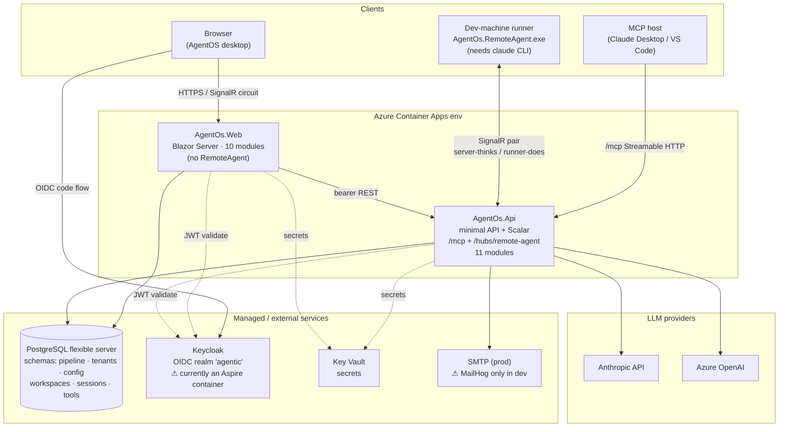
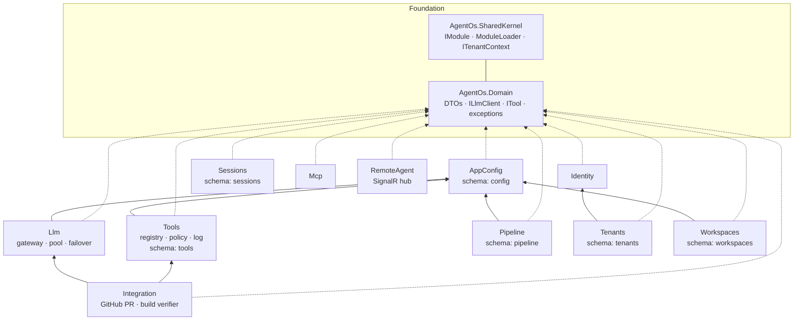
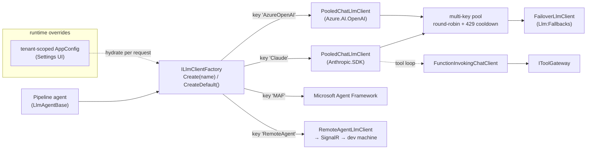
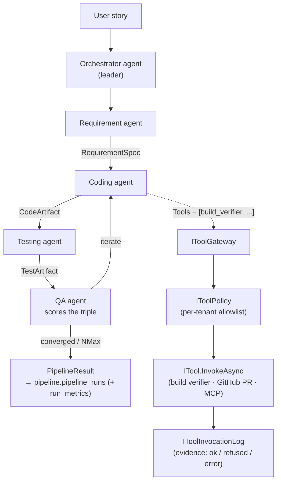

# AgentOS — Architecture

> Source of truth for the system shape. Diagrams are [Mermaid](https://mermaid.js.org/) — they
> render on GitHub and in most Markdown viewers. Verified against the code on 2026-06-07
> (csproj references, host module sets, hub mapping).

AgentOS is a **.NET 10 modular monolith**: every feature is a self-contained `IModule` that
references **`AgentOs.Domain` + `AgentOs.SharedKernel` only**, owns its DbContext + Postgres schema
+ migration history, and is wired into a host by one `AddModulesFromAssemblies(...)` call. Two
composition roots ship the product: the **Api** (minimal API + `/mcp` + the SignalR hub) and the
**Web** (Blazor Server AgentOS desktop).

---

## 1. Deployment topology

How the pieces run in production (Azure Container Apps via Aspire + `azd`) and where the dev-machine
runner plugs in.

**Deploy notes / risks**
- `azd up` deploys the whole Aspire app model. Keycloak is declared as a **container** in
  `infra/AgentOs.AppHost/Program.cs` → it lands in ACA too. Keycloak-in-a-container (bootstrap
  admin param, data volume, theme bind-mount) is **not a production identity story** — use a managed
  Keycloak / Entra External ID and point `Auth:Keycloak:Authority` at it.
- MailHog is gated behind `if (!isPublish)` (run-mode only, "never ship to cloud"), so it does **not**
  land in ACA; it is a dev catcher and prod needs a real `Email:SmtpHost`.
- The runner's default hub is `https://localhost:5080/hubs/remote-agent` (**Api**). The Web host does
  **not** include the RemoteAgent module, so pairing must target the Api host.

---

## 2. Module dependency graph (modular monolith)

Every module sits on `Domain` + `SharedKernel`. Cross-module edges are explicit and minimal
(verified from `.csproj` references).

| Host | Modules included |
|---|---|
| **Api** | AppConfig, Llm, Tools, Pipeline, Integration, Identity, Tenants, Workspaces, Sessions, **Mcp**, **RemoteAgent** (all 11) |
| **Web** | AppConfig, Llm, Tools, Pipeline, Integration, Identity, Tenants, Workspaces, Sessions, **Mcp** (10 — no RemoteAgent) |

---

## 3. LLM gateway (provider-agnostic)

The 5 agents depend only on `ILlmClient` (Domain). The factory resolves a keyed client by its
**canonical** provider name; the pooled client round-robins a multi-key pool and fails over on 429.

> Canonical keys are **`Claude`** and **`AzureOpenAI`**. `appsettings.json` may set
> `Agents:*:Provider = "Anthropic"` and Web `Llm:Provider = "Anthropic"` — `Anthropic` is a supported
> alias for `Claude` (and `Azure`/`OpenAI` for `AzureOpenAI`): `LlmClientFactory.NormalizeKey` maps
> these to the canonical key before the keyed lookup.

---

## 4. Pipeline — Leader / Specialists / Quality loop

A user story flows through 4 specialists; QA scores requirement↔code↔test consistency and loops
until convergence or the `NMax` iteration cap. Tools run through the governance seam.

**Governance moat:** every tool call — local, MCP, or dispatched to a remote runner — passes through
`IToolGateway → IToolPolicy → ITool → IToolInvocationLog`. The server decides and records; the
runner only executes ("server thinks, runner does").

---

## 5. Persistence & multi-tenancy

- One Postgres, **one schema per module** (`pipeline`, `tenants`, `config`, `workspaces`,
  `sessions`, `tools`), each with its own `__EFMigrationsHistory`. Each module applies its migrations
  at startup via its init hook.
- No connection string **+ `Persistence:RequireDatabase=false`** ⇒ modules fall back to **no-op
  repositories** so a host boots stateless (dev / CI). Production sets `RequireDatabase=true` (default
  in Api; forced true for Web in Production), so the persistence modules (Pipeline, Workspaces,
  Sessions, …) **throw at startup** when the connection string is empty — a missing connection string
  fails to boot rather than losing data.
- Row-level isolation: tenant-scoped entities carry `TenantId` + an EF global query filter reading
  `ITenantContext.TenantId`. Auth is Keycloak OIDC only (RS256, `tenant` claim); the API validates
  bearer tokens against the realm JWKS, the Web uses cookie + OIDC.
- A Blazor interactive-Server component has no `HttpContext` → read the tenant from
  `AuthenticationState`, never from `ITenantContext` inside a circuit.
